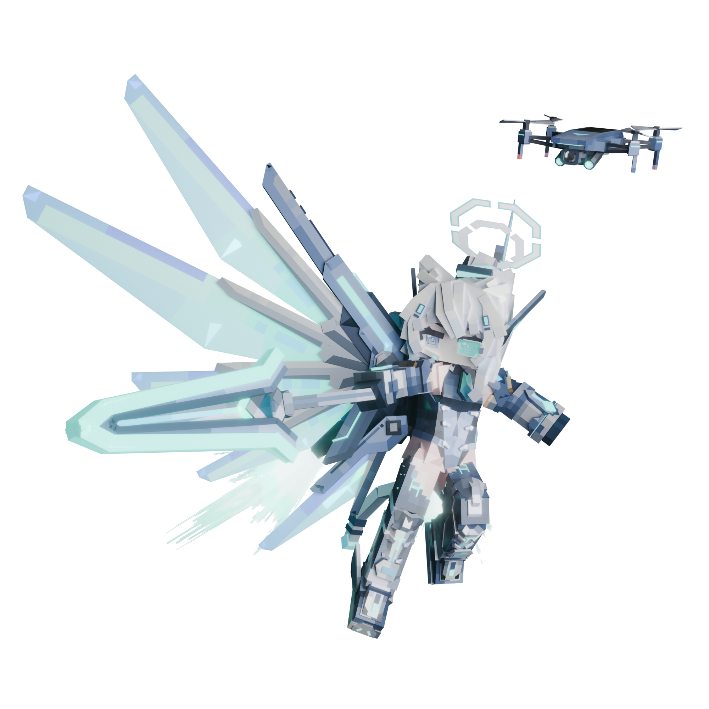

> 小螺坚称自己买下这套机甲纯粹是为了“拆零件卖废铁补贴家用”。但大家很快发现，这具兼具太阳能续航、矢量推进器与战术折叠翼的尖端外骨骼，被她改造成了目前全市最快的外卖自提架兼超频移动工位。“直冲云霄？不不不，那种超重力加速度对关节轴承很不好的咕！”小螺推了推工作耳麦解释道，“但不得不说，机甲带来的额外算力，能让我同时挂着六十个客服咨询窗口，还能在后台顺便把《恶魔城》通关三遍——而且再也不用担心给酒狐添麻烦了的咕！”

## K螺诺亚·御天巡逻者（Kluonoa, the Skyward Patroller）YSM 模型制作人员表

原设画师：
  - [Sangjam](https://space.bilibili.com/474161531)

模型：
  - Nona-Reeves（人物模型）
  - [Maks怜悯](https://space.bilibili.com/352177387)（车车模型）

动画：
  - [咖啡鱼](https://space.bilibili.com/104972076)
  - [雅音宫羽](https://space.bilibili.com/44218)
  - [秋风](https://space.bilibili.com/375227559)
  - [自动服务网络](https://space.bilibili.com/500395823)

PBR材质：
  - [12ssssss](https://space.bilibili.com/14698522)
  - [TKYHJ](https://space.bilibili.com/449147184)

模型优化：
  - [Dumnheint](https://space.bilibili.com/36644599)

模型修改：
  - [TIS长夜孤星](https://space.bilibili.com/388405501)

原设：
  - [K螺诺亚](https://space.bilibili.com/3546599305251347)

---

## 授权许可

本模型采用 [CC BY-NC-SA 4.0](https://creativecommons.org/licenses/by-nc-sa/4.0/deed.zh) 协议授权，即：署名-非商业性使用-相同方式共享 4.0 国际。

- **署名**：使用时请注明模型来源及作者。
- **非商业性使用**：不得将本模型及其衍生作品用于任何商业用途。
- **相同方式共享**：若基于本模型进行修改、二次创作，必须采用与本协议一致的许可协议进行共享。

## 额外条款

除特殊许可外，不得将模型在网易 Minecraft 平台以付费或免费组件包发布

严禁将本模型用于以下内容：

- 色情或色情擦边、性暗示等其他不适宜未成年人的内容
- 血腥暴力内容
- 违法、违规内容

---

- **装备名称**：御天巡逻者（Skypatrol Frame）
- **获取渊源**：
  原本是小螺在二手交易平台上淘回来的报废外骨骼，本打算以废件价格拆解零件来给自己和“噗噜噗噜咕”当备件用。通电测试后发现性能远超预期，于是花费大量心思进行了全面重构改装：针对自身 157cm 的娇小体格重新校准受力结构，移除了不需要的暴力进攻模块，改装为轻量化、便携且实用的穿戴式机装。

- **核心规格与机制**：
  - **推进与飞行**：配备双联多向矢量推进器，支持长时间低空悬停巡航；亦可以严重消耗电量为代价，进行短时间的过载超高速飞行。
  - **外置算力扩展**：机装内置高规格运算副核，能大幅减轻小螺主核负载，不仅极大提升临场反应速度、胜任大规模复杂运算，更能让她在居家办公时多开数十个客服会话窗口。
  - **便携折叠与收纳**：整套机装采用模块化高密折叠设计，未激活时可完全折叠成标准双肩包大小，小螺开车出行时可顺手收纳在“噗噜噗噜咕”后座的工作台或储物空间内。
  - **能源双向互充**：
    - 机装展开的大型机翼表面覆盖高转化率太阳能晶片，白天巡航可进行光能自充以延长续航。
    - 具备**反向供电功能**，在小螺本体电量跌破危险线时能反哺本体，极大缓解小螺长期以来的“续航焦虑”。
  - **自卫与同伴守护协议**：
    - 预留模块化挂点，可根据需要加装传感器或防护装备。
    - 尽管小螺骨子里讨厌暴力打斗，但当身边的朋友陷入危险时，她会毫不犹豫解除安全锁、穿戴机装挺身而出拿起武器保护大家。
